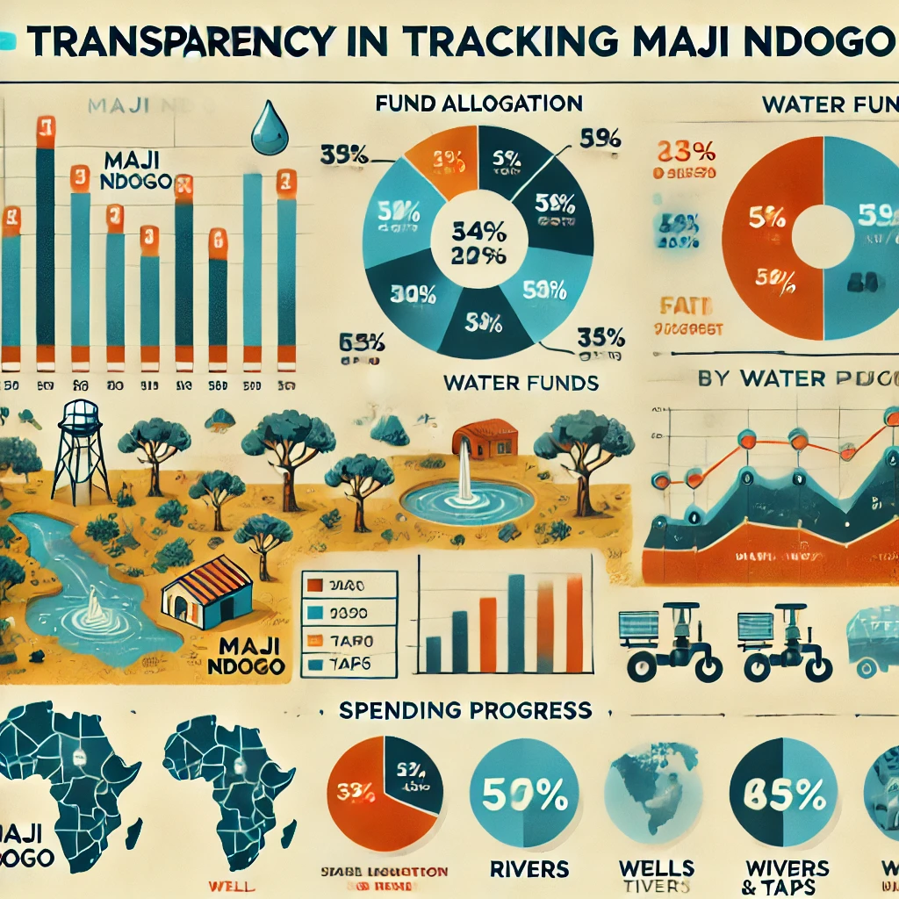

# Tracking Maji Ndogo Funds

## Introduction

This Power BI project aims to analyze and visualize the budgets allocated to various water sources across the fictional state of Maji Ndogo. Using advanced DAX calculations and interactive visualizations, the project provides detailed insights into which water sources in different provinces require urgent repairs, the budgets necessary to address these issues, and the most efficient allocation of available funds. In addition to infrastructure fixes, the project also includes budget analysis for the engineering teams responsible for maintenance and repairs, tracking the longevity and condition of the infrastructure. 
By identifying urgent needs and ensuring transparent fund management, this project helps guide effective decision-making for sustainable water management in Maji Ndogo.

**_Disclaimer_**: All datasets and reports do not represent any company, institutions or country but just a fictional dataset to demonstrate the capabilities of power BI

## Problem Statement
- What is the total estimated budget required to address water infrastructure challenges across all provinces and towns in Maji Ndogo?
- Which provinces have the highest priority for improvements?
- How can we ensure transparency in tracking the allocation and utilization of funds for water infrastructure improvements?
- What is the budget distribution between rural and urban areas and is the allocation sufficient to address disparities in access to water?
- How can we minimize costs in water infrastructure projects without compromising quality or access?
- What are the long-term financial implications of the current infrastructure improvements, and how can its sustainability be ensured?
- How will budget constraints or surpluses impact the timeline for project completion, and what contingencies can be made for fluctuating costs?
- 

## Data Sourcing

Downloaded the csv files from ALX Explore AI Course and extracted it into power bi for cleaning, analysis and visualization.
Data used in this project:

[Md_water_services_data.xlsx](https://github.com/lisaogeya/Visualizing_the_currents_of_change_in_Maji_Ndogo/blob/main/Md_water_services_data.xlsx)

## Data Modelling

## Data Transformation

## Analysis and Visualizations
